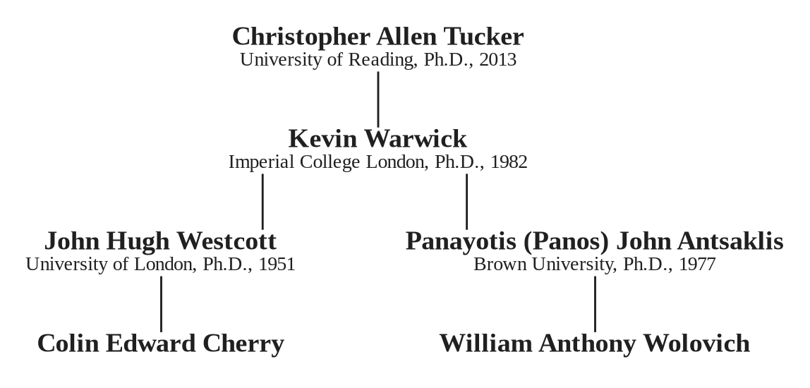

# Christopher Allen Tucker: Academic Genealogy and Research

Christopher Allen Tucker received a Ph.D. from the University of Reading in 2013 for *The Transmission of Wireless Power by Magnetic Resonance*. The Mathematics Genealogy Project records Kevin Warwick as his advisor. Warwick’s own record leads through two recorded advisor branches: John Hugh Westcott and Panayotis (Panos) John Antsaklis.

## Tucker’s recorded genealogy

{ width=78% }

This is a bounded lineage extract, not a claim to a complete intellectual or institutional genealogy. It identifies the recorded control-systems connections relevant to the subscriber research note.

*Source: Mathematics Genealogy Project, “Christopher Allen Tucker,” ID 177516, accessed 10 September 2026; Kevin Warwick, ID 142578; John Hugh Westcott, ID 116874; Panayotis (Panos) John Antsaklis, ID 142577.*
