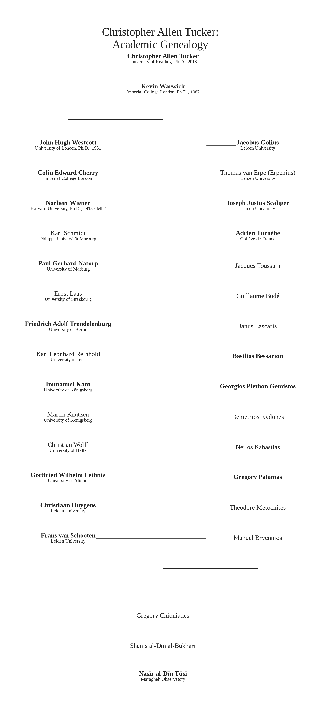

# Academic Genealogy: Christopher Allen Tucker

*A short record of a technical lineage*

Academic genealogy is a form a pedigree althgouh, like its other forms, is still not an argument from authority. It does not tell us what a researcher believed, what a dissertation proves, or what work should be trusted and celebrated. It records something more limited and, for that reason, useful: who supervised a doctorate, and the institutional paths through which a technical tradition can be traced.

This note begins with Christopher Allen Tucker, whose 2013 Ph.D. at the University of Reading was titled *The Transmission of Wireless Power by Magnetic Resonance*. The Mathematics Genealogy Project records Kevin Warwick as Tucker’s advisor.

That one recorded relationship is enough to open a small but relevant map. Warwick’s own doctoral record names two advisors: John Hugh Westcott and Panayotis (Panos) John Antsaklis. Westcott’s line leads to Colin Edward Cherry; Antsaklis’s line leads to William Anthony Wolovich. These are not incidental names in this context. They locate the record in a history of control, communication, systems theory, and cybernetics.

*A selected academic genealogy in the scholarly-page style of the Trakhtenbrot reference. The principal line proceeds from student to advisor in paired columns, then resolves into a centered Chioniades–al-Bukhārī–al-Ṭūsī sequence.*

The final centered sequence marks a different kind of historical interest. Gregory Chioniades studied Persian astronomy in Tabriz at the school of Shams al-Dīn al-Bukhārī, who was instrumental in enabling his work with those astronomical materials. Chioniades then helped carry Persian astronomical learning into Byzantine Greek. This is a documented route of scholarly transmission; the genealogy diagram itself does not establish a simple or exclusive route from that work to the European Renaissance. [Encyclopaedia Iranica](https://www.iranicaonline.org/articles/byzantine-iranian-relations/), [Max Planck Institute for the History of Science](https://ismi.mpiwg-berlin.mpg.de/biography/Shams_al-Din_al-Bukhari_BEA.htm)

The diagram is deliberately brief. Its purpose is not to manufacture a grand lineage or turn technical work into mythology. It is to make a research path inspectable. A name in a bibliography can appear disconnected from the institutions, teachers, and problems through which a field was formed. A genealogy cannot close that gap completely, but it can show that a technical world has a history.

There is a useful parallel with the work of this series. We do not learn much by treating a machine as a sealed result. We ask what components, paths, states, and constraints make its conduct possible. Academic work also has paths. The advisor relation is not a complete explanation of an idea, but it is a documented connection: a point at which one researcher’s work was formally supervised within an institution.

That is why this page keeps its claims narrow.

- It records doctoral-advisor relationships, not intellectual ownership.
- It identifies a control-systems and cybernetics context, not a direct chain of influence.
- It is a map for further reading, not a substitute for reading the work itself.

For readers who want to inspect the broader record, the complete reachable advisor tree is available as a large-format vector chart and searchable index. It extends through 307 recorded people and 372 advisor relationships. That larger artifact is useful as an archive, but the selected branch above is the more useful place to begin.

## Source records

- [Christopher Allen Tucker, Mathematics Genealogy Project, ID 177516](https://genealogy.math.ndsu.nodak.edu/id.php?id=177516)
- [Kevin Warwick, Mathematics Genealogy Project, ID 142578](https://genealogy.math.ndsu.nodak.edu/id.php?id=142578)
- [John Hugh Westcott, Mathematics Genealogy Project, ID 116874](https://genealogy.math.ndsu.nodak.edu/id.php?id=116874)
- [Panayotis (Panos) John Antsaklis, Mathematics Genealogy Project, ID 142577](https://genealogy.math.ndsu.nodak.edu/id.php?id=142577)

*Records accessed 10 September 2026. The Mathematics Genealogy Project is the source for the doctoral and advisor information on this page.*
